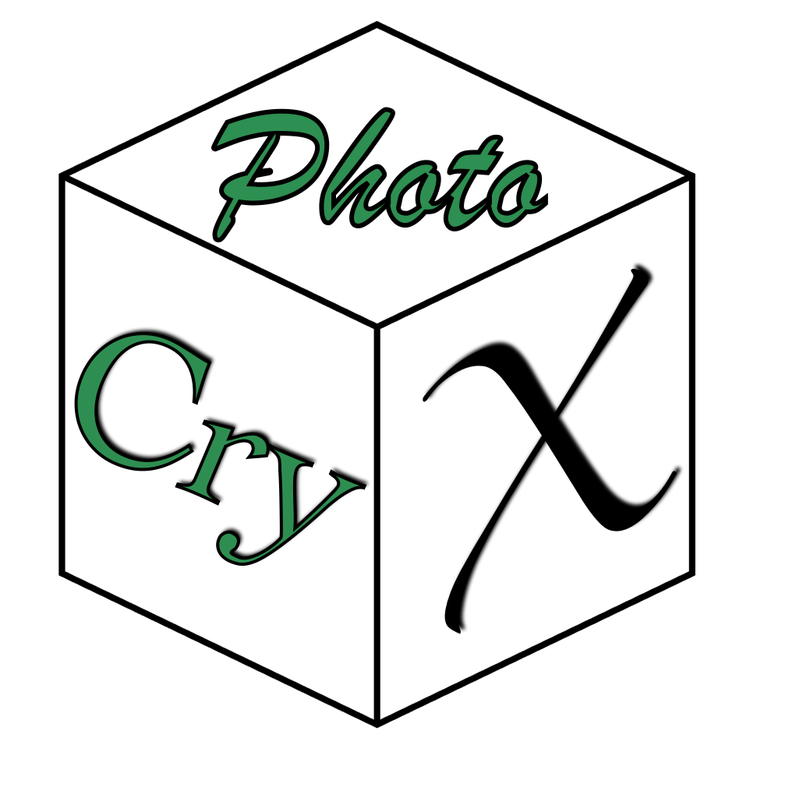

  

### PhotoCryX is a free and open-source tkinter-based graphical user interface (GUI) for MIT photonic bands (MPB) to compute photonic band structures for photonic crystals

## Features
* Free and open-source under GNU General Public License v2.0
* GUI is based on the tkinter package
* Exclusively designed for the computation of band structures in Photonic Crystals
* Currently, the photonic crystals included are
   * 1D Photonic Crystals
   * 2D Photonic Crystals
      * Square Lattice
      * Hexagonal Lattice
      * Honeycomb Lattice
   * 3D Photonic Crystals
      * Simple Cubic Lattice
      * Body-centred cubic (BCC) Lattice
      * Face-centred cubic (FCC) Lattice
      * Diamond Lattice
* Standard lattices with cylinders and spheres can be dynamically modified
* Any complex 2D lattice can be modelled from the GDSII structure import
* 3D visualization using Vis5d and Mayavi is included

        
## File Description
| File | Description |
|------|-------------|
| [Installation.md](https://github.com/donmathew008/PhotoCryX/blob/main/Installation.md) | Installation instructions using conda |
| [PhotoCryX.zip](https://github.com/donmathew008/PhotoCryX/blob/main/PhotoCryX.zip) | Source code |
| [README.md](https://github.com/donmathew008/PhotoCryX/blob/main/README.md) | General Readme file |
| [photocryx.png](https://github.com/donmathew008/PhotoCryX/blob/main/photocryx.png) | PhotoCryX Icon |
