## PhotoCryX tutorial using GUI
#### The initial interface of PhotoCryX is;

  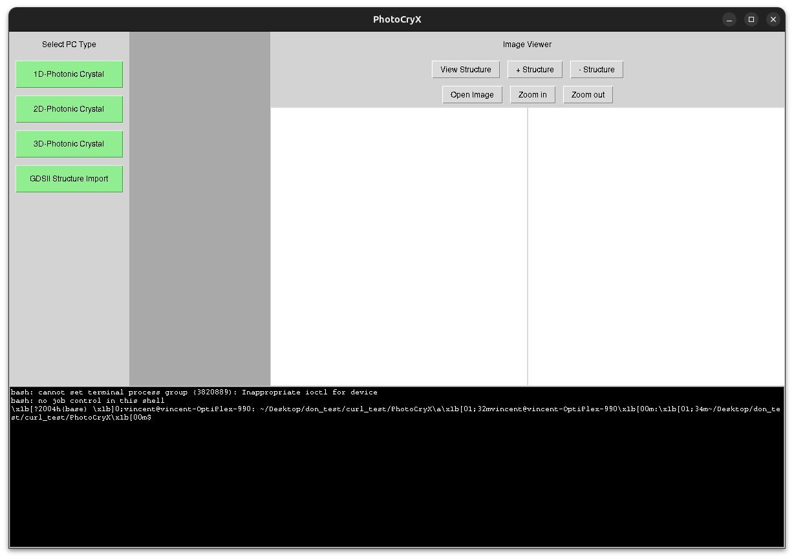

## One-dimensional Photonic Crystal (1DPC)
#### The 1D interface has just the "Run Simulation" button as shown below

  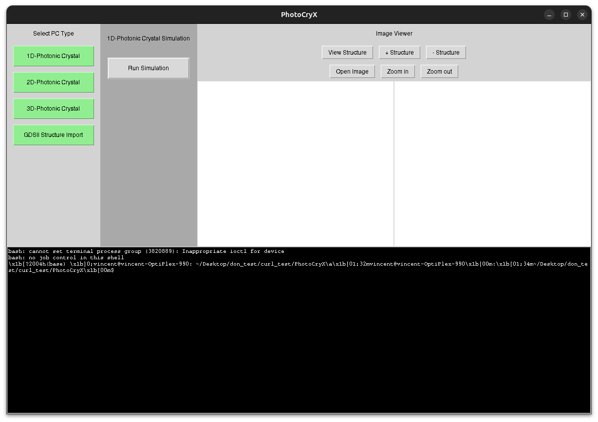

#### This will open a folder-creation pop-up as shown below. If we do not create a folder, the run happens in the parent directory or the source directory
#### So it is better to create a folder, and the source directory remains untouched

  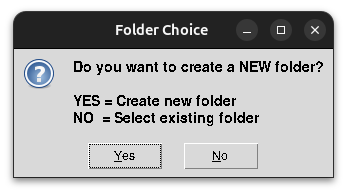

#### Then the parameter pop-up opens up as shown below; either default values can be used or any arbitrary values. It may be noted that currently 'nm' structures are only optimized

  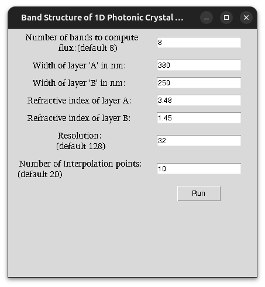

#### The computed epsilon and band structure are displayed as shown; it also computes the field, which can be opened directly by clicking the "Open Image" tab

  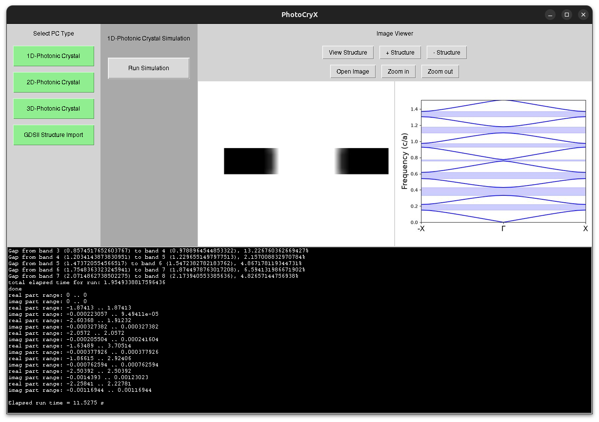

## Two-dimensional Photonic Crystal (2DPC) - Honeycomb lattice

  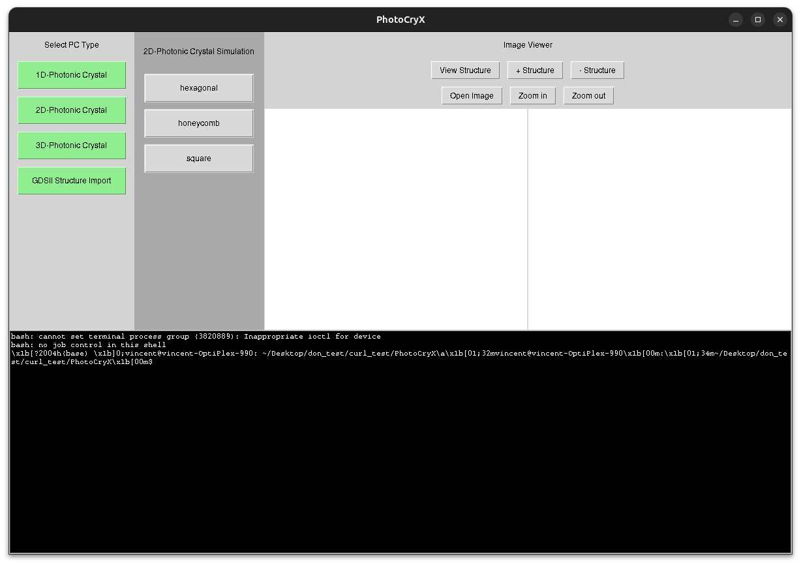

  

  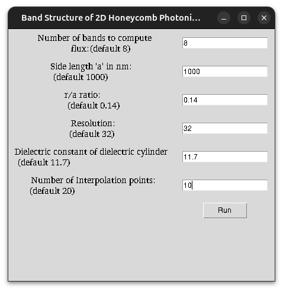

  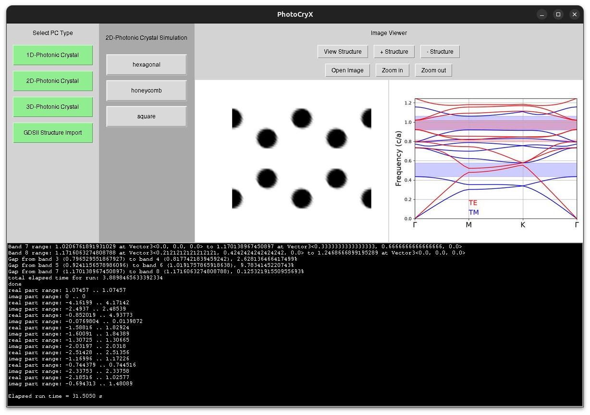

## Three-dimensional Photonic Crystal (3DPC) - FCC lattice

  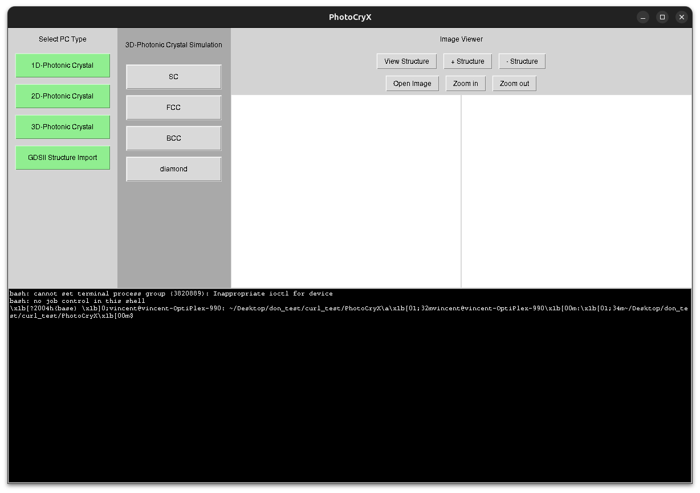

  

  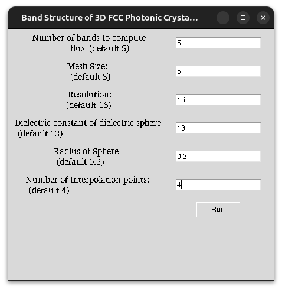

  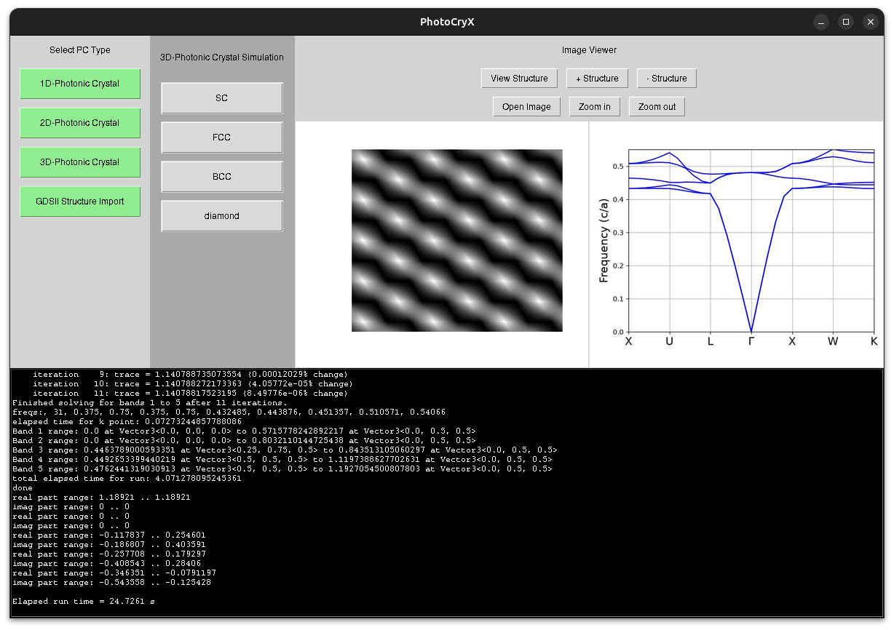

#### The epsilon is just a 2D surface plot, to visualize in 3D we need additional packages like Mayavi or Vis5D, the installation is discussed [here](https://github.com/donmathew008/PhotoCryX/blob/main/Installation.md)
#### All 3D folders are occupied with "plot3d.py" which uses Mayavi, The detailed 3D visualization is given [here](https://github.com/donmathew008/PhotoCryX/blob/main/3D_Visualization.md)

## Executable mode (EXEC) with GDSII file and "mpb.in" in the destination folder

  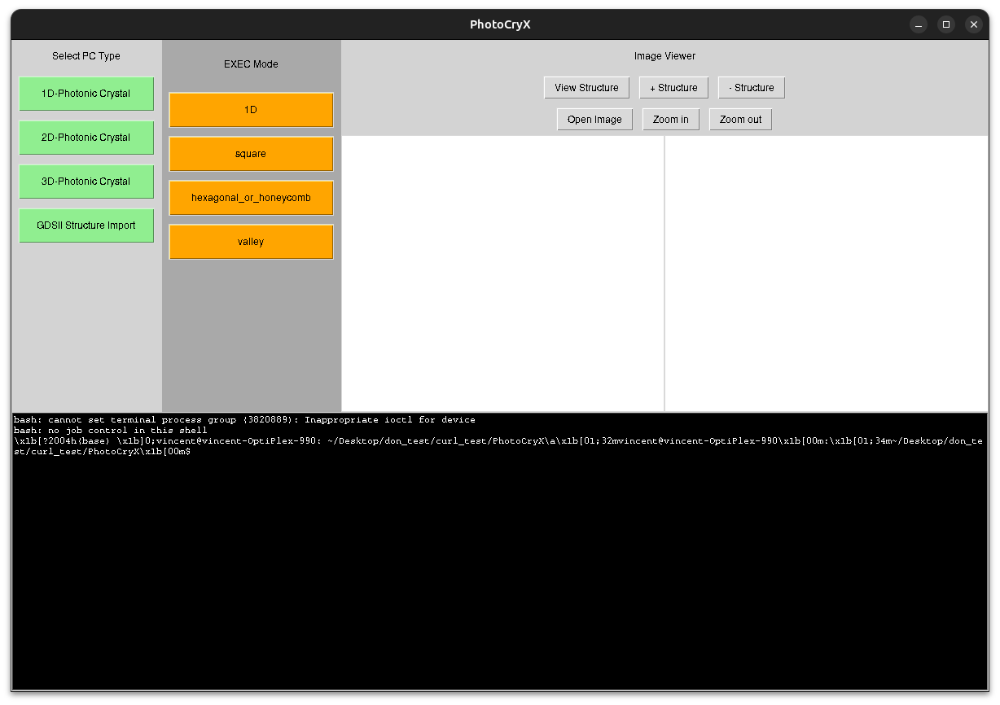

#### The control file or the main input file is "mpb.in", here, a sample is given

  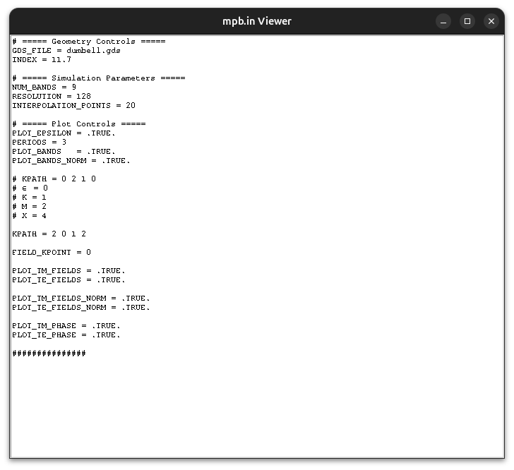

	

	

			

		

